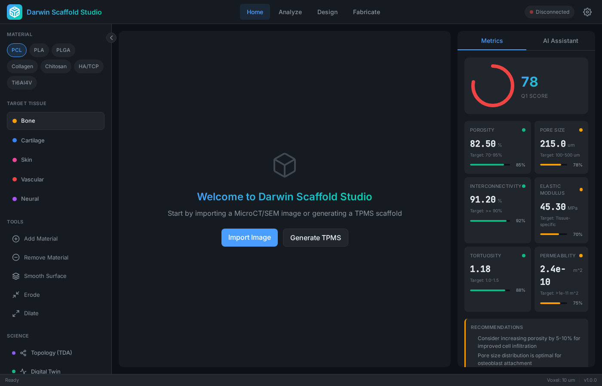

# Darwin Scaffold Studio

[](https://julialang.org/)
[](https://github.com/agourakis82/darwin-scaffold-studio/actions/workflows/ci.yml)
[](LICENSE)
[](https://doi.org/10.5281/zenodo.17832882)

A comprehensive Julia-based platform for tissue engineering scaffold analysis, featuring advanced image processing, topological data analysis, physics-informed neural networks, and AI-powered scientific discovery.

---

## Desktop Application

Premium desktop application with 3D visualization, AI-powered analysis, and scientific panels.



| Platform | Download |
|----------|----------|
| Linux (AppImage) | [darwin-scaffold-studio_1.3.0_amd64.AppImage](https://github.com/agourakis82/DarwinScaffoldStudio.jl/releases/download/desktop-v1.3.0/darwin-scaffold-studio_1.3.0_amd64.AppImage) |
| Linux (Debian/Ubuntu) | [darwin-scaffold-studio_1.3.0_amd64.deb](https://github.com/agourakis82/DarwinScaffoldStudio.jl/releases/download/desktop-v1.3.0/darwin-scaffold-studio_1.3.0_amd64.deb) |
| Windows (Installer) | [Darwin.Scaffold.Studio_1.3.0_x64-setup.exe](https://github.com/agourakis82/DarwinScaffoldStudio.jl/releases/download/desktop-v1.3.0/Darwin.Scaffold.Studio_1.3.0_x64-setup.exe) |
| Windows (MSI) | [Darwin.Scaffold.Studio_1.3.0_x64_en-US.msi](https://github.com/agourakis82/DarwinScaffoldStudio.jl/releases/download/desktop-v1.3.0/Darwin.Scaffold.Studio_1.3.0_x64_en-US.msi) |
| macOS (Apple Silicon) | [Darwin.Scaffold.Studio_1.3.0_aarch64.dmg](https://github.com/agourakis82/DarwinScaffoldStudio.jl/releases/download/desktop-v1.3.0/Darwin.Scaffold.Studio_1.3.0_aarch64.dmg) |

---

## Features

### Core Analysis
- **MicroCT/SEM Image Processing**: Load, denoise (DnCNN), segment, and analyze scaffold images
- **Comprehensive Metrics**: Porosity, pore size distribution, interconnectivity, tortuosity, surface area
- **Mechanical Properties**: Gibson-Ashby model for elastic modulus and yield strength estimation

### Advanced Science Modules (27 modules)
- **PINNs**: Physics-Informed Neural Networks for nutrient/oxygen transport simulation
- **TDA**: Topological Data Analysis with persistent homology (Betti numbers, persistence diagrams)
- **GNN**: Graph Neural Networks for scaffold property prediction
- **Percolation**: Percolation diameter, geodesic tortuosity, connectivity metrics

### AI & Optimization
- **Multi-Agent System**: Autonomous design, analysis, and synthesis agents
- **Biomimetic Patterns**: Fibonacci pore distributions, Murray's law vascularization
- **TPMS Generation**: Gyroid, Schwarz D/P, Neovius surfaces

### Ontology & FAIR Data
- **OBO Foundry Integration**: UBERON (anatomy), CL (cells), CHEBI (materials)
- **FAIR Export**: JSON-LD with Schema.org vocabulary for reproducible research
- **Material Libraries**: 50+ polymers, ceramics, and bioactive materials with properties

---

## Installation

### Prerequisites
- Julia 1.10+
- 8GB RAM minimum (16GB recommended)

### Package Install

```julia
using Pkg
Pkg.add("DarwinScaffoldStudio")
```

### From Source

```bash
git clone https://github.com/agourakis82/darwin-scaffold-studio.git
cd darwin-scaffold-studio
julia --project=. -e 'using Pkg; Pkg.instantiate()'
```

---

## Quick Start

### Basic Scaffold Analysis

```julia
using DarwinScaffoldStudio

# Create or load a scaffold
scaffold = create_test_scaffold(100, 100, 100, porosity=0.75)

# Compute metrics (10 um voxel size)
metrics = compute_metrics(scaffold, 10.0)

println("Porosity: $(round(metrics.porosity * 100, digits=1))%")
println("Mean pore size: $(round(metrics.mean_pore_size_um, digits=1)) um")
println("Interconnectivity: $(round(metrics.interconnectivity * 100, digits=1))%")
```

### Topological Analysis

```julia
# Compute Betti numbers and persistence diagrams
topology = analyze_pore_topology(scaffold)

println("Connected components (B0): $(topology["num_components"])")
println("Tunnels/channels (B1): $(topology["num_loops"])")
println("Interconnectivity score: $(round(topology["interconnectivity_score"], digits=2))")
```

### Percolation Analysis

```julia
# Analyze percolation properties
perc = compute_percolation_metrics(scaffold, 10.0)

println("Status: $(perc["percolation_status"])")
println("Percolation diameter: $(round(perc["percolation_diameter_um"], digits=1)) um")
println("Tortuosity: $(round(perc["tortuosity_index"], digits=2))")
```

### Load Real MicroCT Data

```julia
# Load and process MicroCT scan
img = load_image("path/to/scaffold.tif")
denoised = denoise_microct(img, method="dncnn")
binary = segment_scaffold(denoised, "otsu")

metrics = compute_metrics(binary, 20.0)  # 20 um voxels

# Export mesh
vertices, faces = create_mesh_simple(binary, 20.0)
export_stl("scaffold.stl", vertices, faces)
```

---

## Module Overview

```
DarwinScaffoldStudio/
├── Core/           # Configuration, types, utilities
├── MicroCT/        # Image loading, preprocessing, segmentation
├── Science/        # Topology, Percolation, ML, PINNs, TDA, GNN
├── Optimization/   # Parametric design, scaffold optimization
├── Visualization/  # Mesh export, NeRF, Gaussian splatting
├── Agents/         # AI agents for design and analysis
├── Ontology/       # OBO Foundry integration, FAIR export
├── Fabrication/    # G-code generation for bioprinting
└── Pipeline/       # End-to-end workflows
```

---

## Documentation

| Document | Description |
|----------|-------------|
| [QUICKSTART.md](QUICKSTART.md) | Get running in 5 minutes |
| [docs/guides/tutorial.md](docs/guides/tutorial.md) | Complete usage tutorial |
| [docs/reference/api.md](docs/reference/api.md) | Full API reference |
| [docs/api/science.md](docs/api/science.md) | Science modules (PINNs, TDA, GNN) |
| [docs/ARCHITECTURE.md](docs/ARCHITECTURE.md) | System architecture |
| [CLAUDE.md](CLAUDE.md) | Development context |

---

## Testing

```bash
# Quick module loading test
julia --project=. test/test_minimal.jl

# Run science module tests
julia --project=. test/test_science.jl

# Full test suite
julia --project=. test/runtests.jl
```

---

## Literature References

This platform implements metrics validated against peer-reviewed literature:

- **Murphy et al. (2010)**: Optimal pore size 100-300 um for bone
- **Karageorgiou & Kaplan (2005)**: Porosity 85-95%, interconnectivity >90%
- **Gibson & Ashby (1997)**: E_scaffold = E_solid x (1 - porosity)^2

---

## Contributing

Contributions welcome! See [docs/development/CONTRIBUTING.md](docs/development/CONTRIBUTING.md).

1. Fork the repository
2. Create a feature branch
3. Commit your changes
4. Open a Pull Request

---

## License

MIT License - see [LICENSE](LICENSE).

---

## Citation

```bibtex
@software{darwin_scaffold_studio,
  author = {Agourakis, Demetrios Chiuratto},
  title = {Darwin Scaffold Studio: Multi-Modal AI Platform for Tissue Engineering},
  year = {2025},
  doi = {10.5281/zenodo.17832882},
  url = {https://github.com/agourakis82/darwin-scaffold-studio}
}
```

---

*Darwin Scaffold Studio v3.3.1 - 27 modules for comprehensive scaffold analysis*
